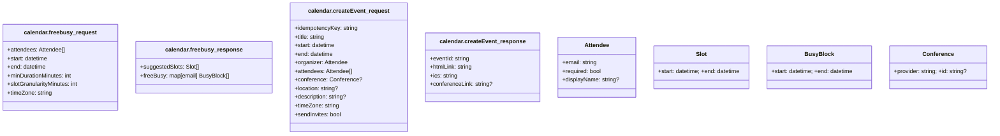

1. Install Requrements : `python -m pip install -r requirements.txt`
2. Run : `streamlit run main.py`
3. Go To Website: [http://localhost:8501/](http://localhost:8501) 

## Core messages (conceptual)

* `Schedule.Request` → user intent (title, duration, participants, window)
* `Calendar.FreeBusy.Query` → agent → server
* `Agent.Proposal` → agent → user (N candidate slots)
* `Schedule.Confirm` → user picks a slot
* `Calendar.Event.Create` → agent → server (idempotent)
* `Agent.Receipt` → agent → user (success/failure + event link)

## MCP surface (tools)

The Calendar MCP Server exposes these **tools**:

1. **`calendar.freebusy`**

* **input**:

  ```json
  {
    "attendees": [{"email":"alice@example.com"}, {"email":"bob@example.com"}],
    "start": "2025-11-03T09:00:00Z",
    "end":   "2025-11-07T18:00:00Z",
    "minDurationMinutes": 30,
    "slotGranularityMinutes": 30,
    "timeZone": "America/Los_Angeles"
  }
  ```
* **output**:

  ```json
  {
    "suggestedSlots": [
      {"start":"2025-11-04T17:00:00Z","end":"2025-11-04T17:30:00Z"},
      {"start":"2025-11-04T18:00:00Z","end":"2025-11-04T18:30:00Z"}
    ],
    "freeBusy": {
      "alice@example.com": [{"start":"...","end":"..."}],
      "bob@example.com":   [{"start":"...","end":"..."}]
    }
  }
  ```

2. **`calendar.createEvent`**

* **input**:

  ```json
  {
    "idempotencyKey": "b6c3c4b9-3b2e-4a8f-9a9d-1c2d3e4f5a6b",
    "title": "Weekly sync",
    "start": "2025-11-04T17:00:00Z",
    "end":   "2025-11-04T17:30:00Z",
    "organizer": {"email":"andor@agentoverlay.com"},
    "attendees": [
      {"email":"alice@example.com","required":true},
      {"email":"bob@example.com","required":true}
    ],
    "conference": {"provider":"google-meet"},
    "location": "Virtual",
    "description": "Agenda: status & blockers",
    "timeZone": "America/Los_Angeles",
    "sendInvites": true
  }
  ```
* **output**:

  ```json
  {
    "eventId": "cal_abc123",
    "htmlLink": "https://calendar.google.com/event?eid=...",
    "ics": "BEGIN:VCALENDAR...\nEND:VCALENDAR",
    "conferenceLink": "https://meet.google.com/xyz-abcd-efg"
  }
  ```

> **Resources (optional):** The server may list resources like `mcp://calendar/calendars/primary` to scope calls, and secrets are handled via MCP’s standard secret flow.

## Minimal error codes

* `CONFLICT_ATTENDEE_BUSY`
* `PERMISSION_DENIED`
* `INVALID_TIME_RANGE`
* `RATE_LIMITED`
* `INTERNAL_UPSTREAM`

## Privacy & safety nits

* Only collect emails and time windows you need.
* Use `idempotencyKey` to make retries safe.
* Prefer split-horizon: agent only sees availability summaries, not full details, unless allowed.

## Mermaid: end-to-end sequence


## Mermaid: tool surface (schema sketch)



---

## Example MCP tool declarations (server manifest excerpt)

```json
{
  "name": "calendar-mcp",
  "version": "0.1.0",
  "tools": [
    {
      "name": "calendar.freebusy",
      "description": "Return suggested slots and free/busy summaries.",
      "input_schema": {"type":"object","required":["attendees","start","end","minDurationMinutes","slotGranularityMinutes","timeZone"],"properties":{
        "attendees":{"type":"array","items":{"type":"object","required":["email"],"properties":{"email":{"type":"string","format":"email"},"required":{"type":"boolean"},"displayName":{"type":"string"}}}},
        "start":{"type":"string","format":"date-time"},
        "end":{"type":"string","format":"date-time"},
        "minDurationMinutes":{"type":"integer","minimum":15},
        "slotGranularityMinutes":{"type":"integer","enum":[15,30,60]},
        "timeZone":{"type":"string"}
      }},
      "output_schema":{"type":"object","required":["suggestedSlots","freeBusy"],"properties":{
        "suggestedSlots":{"type":"array","items":{"type":"object","required":["start","end"],"properties":{"start":{"type":"string","format":"date-time"},"end":{"type":"string","format":"date-time"}}}},
        "freeBusy":{"type":"object","additionalProperties":{"type":"array","items":{"type":"object","required":["start","end"],"properties":{"start":{"type":"string","format":"date-time"},"end":{"type":"string","format":"date-time"}}}}}
      }}
    },
    {
      "name": "calendar.createEvent",
      "description": "Create an event and send invites.",
      "input_schema":{"type":"object","required":["idempotencyKey","title","start","end","organizer","attendees","timeZone","sendInvites"],"properties":{
        "idempotencyKey":{"type":"string"},
        "title":{"type":"string"},
        "start":{"type":"string","format":"date-time"},
        "end":{"type":"string","format":"date-time"},
        "organizer":{"type":"object","required":["email"],"properties":{"email":{"type":"string","format":"email"}}},
        "attendees":{"type":"array","items":{"type":"object","required":["email"],"properties":{"email":{"type":"string","format":"email"},"required":{"type":"boolean"},"displayName":{"type":"string"}}}},
        "conference":{"type":"object","required":["provider"],"properties":{"provider":{"type":"string"},"id":{"type":"string"}}},
        "location":{"type":"string"},
        "description":{"type":"string"},
        "timeZone":{"type":"string"},
        "sendInvites":{"type":"boolean"}
      }},
      "output_schema":{"type":"object","required":["eventId","htmlLink","ics"],"properties":{
        "eventId":{"type":"string"},
        "htmlLink":{"type":"string"},
        "ics":{"type":"string"},
        "conferenceLink":{"type":"string"}
      }}
    }
  ],
  "resources": [
    {
      "uri": "mcp://calendar/calendars/primary",
      "name": "Primary Calendar",
      "description": "Default calendar scope for calls"
    }
  ]
}
```

---

## Tiny “happy path” prompt→tool exchange (agent side)

1. Agent summarizes the user ask into params and calls:

```json
{"tool_name":"calendar.freebusy","arguments":{
  "attendees":[{"email":"alice@example.com"},{"email":"bob@example.com"}],
  "start":"2025-11-03T17:00:00Z",
  "end":"2025-11-07T02:00:00Z",
  "minDurationMinutes":30,
  "slotGranularityMinutes":30,
  "timeZone":"America/Los_Angeles"
}}
```

2. After user picks a slot:

```json
{"tool_name":"calendar.createEvent","arguments":{
  "idempotencyKey":"b6c3c4b9-3b2e-4a8f-9a9d-1c2d3e4f5a6b",
  "title":"Weekly sync",
  "start":"2025-11-04T18:00:00Z",
  "end":"2025-11-04T18:30:00Z",
  "organizer":{"email":"andor@agentoverlay.com"},
  "attendees":[
    {"email":"alice@example.com","required":true},
    {"email":"bob@example.com","required":true}
  ],
  "conference":{"provider":"google-meet"},
  "location":"Virtual",
  "description":"Agenda: status & blockers",
  "timeZone":"America/Los_Angeles",
  "sendInvites":true
}}
```

---

if you want, I can drop this into a ready-to-run MCP server skeleton (TypeScript or Go) and a sample agent prompt to demo end-to-end.


